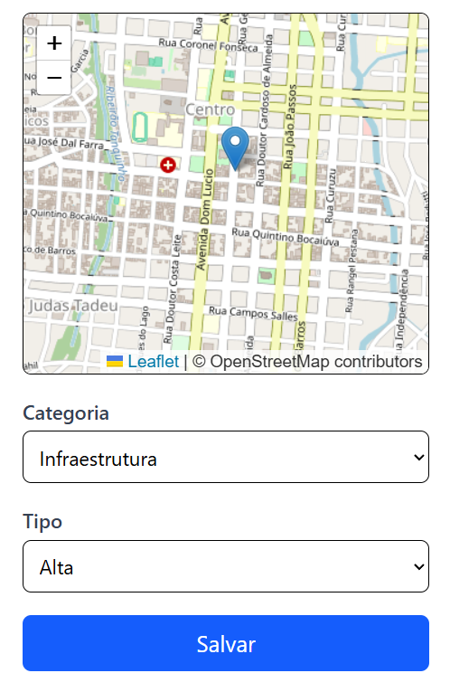
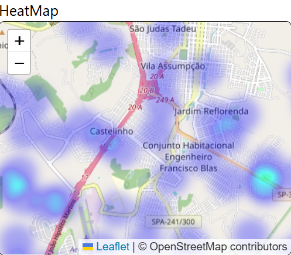
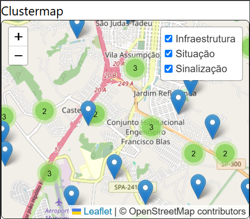

### Desenvolvimento
- [x]  Formulário de envio 
- [x]  Banco de Dados
- [x]  Mapa de calor 
- [x]  Mapa de clusters
- [ ]  Aprimoramento da UI
- [ ]  Aprimoramento de visualização dos mapas (limitação de território, limitação de zoom in/out, marcadores)
- [ ]  Componentes de navegação entre páginas
- [ ]  Dashboard com gráficos dos dados
- [ ]  Componente de coleta de localização do usuário no formulário
- [ ]  Pop-ups informativos
- [ ]  Alterar input único por select

# DiskRua

O projeto tem como objetivo desenvolver uma aplicação web colaborativa que permita aos cidadãos registrar ocorrências relacionadas à infraestrutura urbana de Botucatu, como buracos, sinalização deficiente, trechos com congestionamento recorrente e outros problemas. A plataforma possibilita o mapeamento das demandas, facilitando a comunicação entre os munícipes e o poder público, gerando dados que podem auxiliar na tomada de decisão. Considerando que a manutenção da infraestrutura urbana é um desafio constante e que muitas vezes os problemas não chegam de forma eficiente às autoridades, o projeto busca criar um canal acessível, interativo, fácil e rápido, incentivando a participação cidadã no compartilhamento de informações sobre situações críticas nas vias da cidade.

### Tela Provisória do Formulário

### Tela Provisória do Mapa de Calor

### Tela Provisória do Mapa de Clusters
